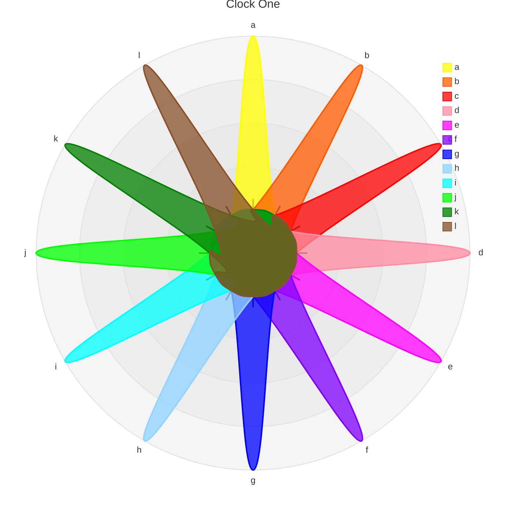
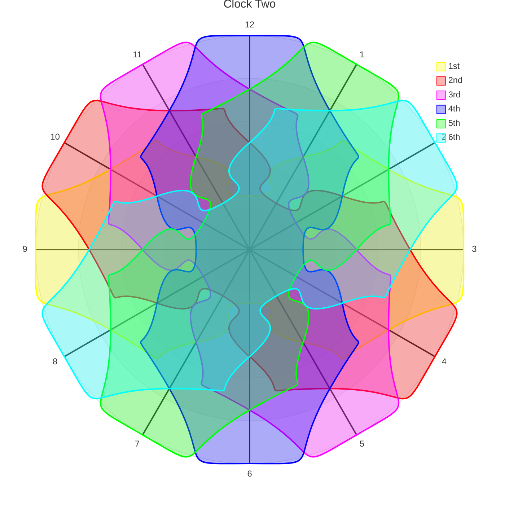
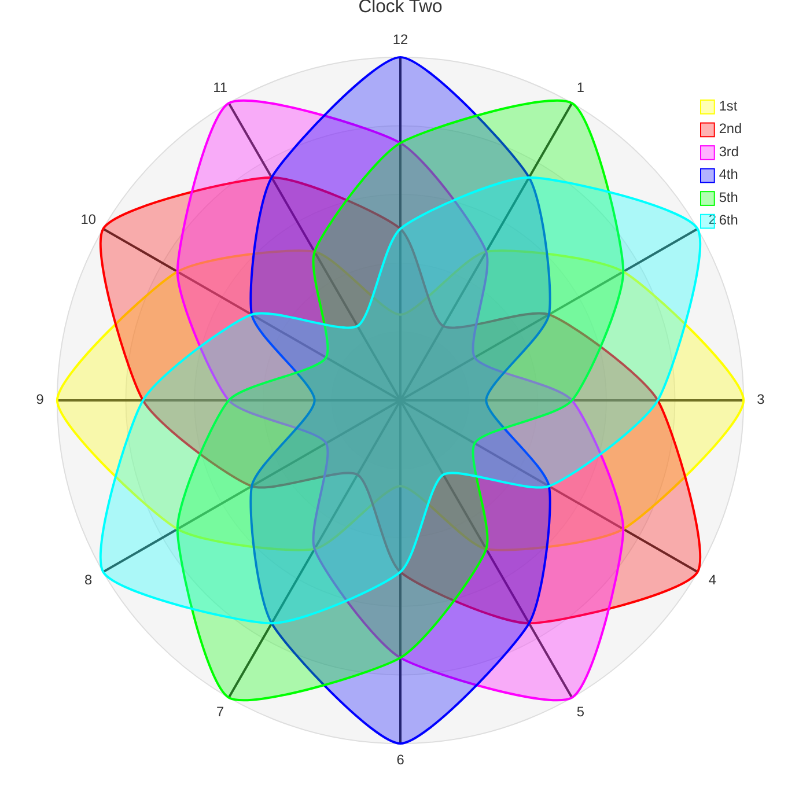

# ['Ee-Cs' GitHub Pages](https://Ee-Cs.github.io)</h3>
[Portfolio](https://github.com/k1729p/Portfolio)

---

<!-- This content will not appear in the rendered Markdown -->
<a name="top"></a>
GitHub Docs [Basic writing and formatting syntax](https://docs.github.com/en/get-started/writing-on-github/getting-started-with-writing-and-formatting-on-github/basic-writing-and-formatting-syntax)

<details>
<summary>⭕ Section 1</summary>

# A first-level heading (One Hash Line)
## A second-level heading (Two Hashes Line)
### A third-level heading (Three Hashes Line)
#### A fourth-level heading (Four Hashes Line)
##### A fifth-level heading (Five Hashes Line)
###### A six-level heading (Six Hashes Line)
1st line **bold** *italic* <sub>Subscript</sub> <sup>Superscript</sup> <ins>Underline</ins> \
2nd line \
3rd line

---
</details>

<details>
<summary>⭕ Section 2</summary>

0️⃣1️⃣2️⃣3️⃣4️⃣5️⃣6️⃣7️⃣8️⃣9️⃣🔟 \
🟥🟩🟦🟪🟨🟧🟫⬜⬛🔲🔳 \
🔴🟢🔵🟣🟡🟠🟤⚪⚫ \
❤️💚💙💜💛🧡🤎🤍🖤 \
⬇️🔽⏬⯆⮟⏷🡇🠟🠋🠇🡻🡫🡣▼▽🔻 \
➡️▶️⏩⯈⮞⏵🡆🠞🠊🠆🡺🡪🡢▶▷🔶🔸◆ \
⬅️◀️⏪⯇⮜⏴🡄🠜🠈🠄🡸🡨🡠◀◁🔷🔹◇ \
⬆️🔼⏫⯅⮝⏶🡅🠝🠉🠅🡹🡩🡡▲△🔺🛆 \
✔️🆗❎❌✖️➕➖⭕ \
▀▄▀▄▀▄▀▄▀▄▀▄▀▄▀▄▀▄▀▄▀▄▀▄▀▄▀▄▀▄▀▄▀▄▀▄▀▄▀▄▀▄▀▄▀▄▀▄▀▄▀▄▀▄ \
1234567890 \
𝟭𝟮𝟯𝟰𝟱𝟲𝟳𝟴𝟵𝟬 \
ABCDEFGHIJKLMNOPQRSTUVWXYZ \
abcdefghijklmnopqrstuvwxyz \
𝐚𝐛𝐜𝐝𝐞𝐟𝐠𝐡𝐢𝐣𝐤𝐥𝐦𝐧𝐨𝐩𝐪𝐫𝐬𝐭𝐮𝐯𝐰𝐱𝐲𝐳 \
𝐀𝐁𝐂𝐃𝐄𝐅𝐆𝐇𝐈𝐉𝐊𝐋𝐌𝐍𝐎𝐏𝐐𝐑𝐒𝐓𝐔𝐕𝐖𝐗𝐘𝐙 \
𝓪𝓫𝓬𝓭𝓮𝓯𝓰𝓱𝓲𝓳𝓴𝓵𝓶𝓷𝓸𝓹𝓺𝓻𝓼𝓽𝓾𝓿𝔀𝔁𝔂𝔃 \
𝓐𝓑𝓒𝓓𝓔𝓕𝓖𝓗𝓘𝓙𝓚𝓛𝓜𝓝𝓞𝓟𝓠𝓡𝓢𝓣𝓤𝓥𝓦𝓧𝓨𝓩 \
▀▄▀▄▀▄▀▄▀▄▀▄▀▄▀▄▀▄▀▄▀▄▀▄▀▄▀▄▀▄▀▄▀▄▀▄▀▄▀▄▀▄▀▄▀▄▀▄▀▄▀▄▀▄ \
The last line with '\\' character at the end of line. \

---
</details>

<details>
<summary>⭕ Section 3</summary>






---
</details>

<details>
<summary>⭕ Section 4</summary>

JSON
```json
{
  "a" : [
    {
      "b" : "c"
    }
  ]
}
```
To download `SHASUMS256.txt` using `curl`:
```bash
curl -O https://nodejs.org/dist/vx.y.z/SHASUMS256.txt
```

---
</details>

<details>
<summary>⭕ Section 5</summary>

Hard line break - add \ or two spaces at the end of line  

The visualization of the color is only supported in issues, pull requests, and discussions. \
`#FF0000` `#00FF00` `#0000FF` `#FFFF00` `#FF00FF` `#0000FF` `#FFFFFF`

CSS styles are not active in GitHub :warning:  
<span style="color:red">red</span>  
<span style="color:green">green</span>  
<span style="color:blue">blue</span>  
<span style="color:cyan">cyan</span>  
<span style="color:magenta">magenta</span>  
<span style="color:yellow">yellow</span>  
<span style="color:orange">orange</span>  
<span style="color:brown">brown</span>  
<span style="color:gray">gray</span>  


---
</details>

[**geojson.md**](geojson.md)

> [!NOTE]
> Useful information that users should know, even when skimming content.

> [!TIP]
> Helpful advice for doing things better or more easily.

> [!IMPORTANT]
> Key information users need to know to achieve their goal.

> [!WARNING]
> Urgent info that needs immediate user attention to avoid problems.

> [!CAUTION]
> Advises about risks or negative outcomes of certain actions.


[Back to the top of the page](#top)