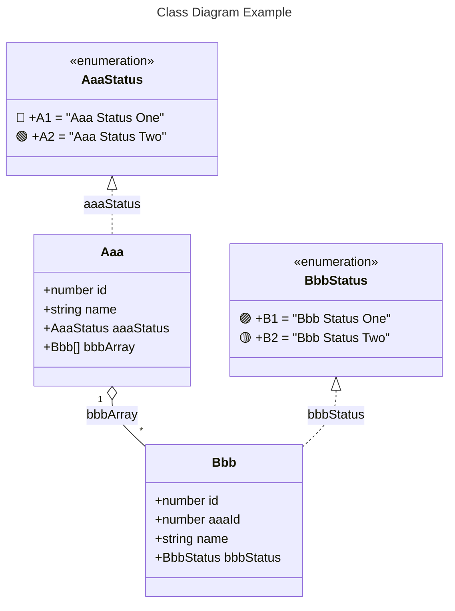

[Class Diagram Syntax](https://mermaid.js.org/syntax/classDiagram.html)

```mermaid
---
title: Class Diagram Example
---
classDiagram
class Aaa {
  +number id
  +string name
  +AaaStatus aaaStatus
  +Bbb[] bbbArray
}

class Bbb {
  +number id
  +number aaaId
  +string name
  +BbbStatus bbbStatus
}

class AaaStatus {
  <<enumeration>>
  🔴 +A1 = "Aaa Status One"
  🟢 +A2 = "Aaa Status Two"
}

class BbbStatus {
  <<enumeration>>
  🟣 +B1 = "Bbb Status One"
  🟡 +B2 = "Bbb Status Two"
}

Aaa "1" o-- "*" Bbb : bbbArray
AaaStatus <|.. Aaa : aaaStatus
BbbStatus <|.. Bbb : bbbStatus
```
