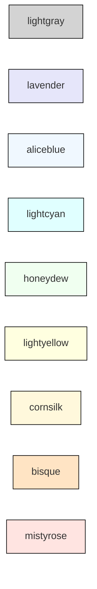
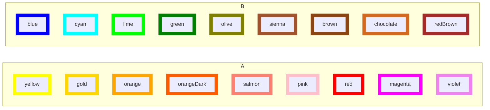

# Fill and Stroke Colors

```mermaid
graph LR
    lightgray:::lightgray
    lavender:::lavender
    aliceblue:::aliceblue
    lightcyan:::lightcyan
    honeydew:::honeydew
    lightyellow:::lightyellow
    cornsilk:::cornsilk
    bisque:::bisque
    mistyrose:::mistyrose
%% Styles
    classDef aliceblue fill:aliceblue,stroke:black,stroke-width:1px
    classDef bisque fill:bisque,stroke:black,stroke-width:1px
    classDef cornsilk fill:cornsilk,stroke:black,stroke-width:1px
    classDef honeydew fill:honeydew,stroke:black,stroke-width:1px
    classDef lavender fill:lavender,stroke:black,stroke-width:1px
    classDef lightcyan fill:lightcyan,stroke:black,stroke-width:1px
    classDef lightgray fill:lightgray,stroke:black,stroke-width:1px
    classDef lightyellow fill:lightyellow,stroke:black,stroke-width:1px
    classDef mistyrose fill:mistyrose,stroke:black,stroke-width:1px
```

---

```mermaid
flowchart LR
subgraph A
    direction TD
    yellow:::yellow
    gold:::gold
    orange:::orange
    orangeDark:::orangeDark
    salmon:::salmon
    pink:::pink
    red:::red
    magenta:::magenta
    violet:::violet
end
subgraph B
    direction TD
    blue:::blue
    cyan:::cyan
    lime:::lime
    green:::green
    olive:::olive
    sienna:::sienna
    brown:::brown
    chocolate:::chocolate
    redBrown:::redBrown
end
%% Styles
    classDef brown stroke:saddlebrown,stroke-width:10px
    classDef blue stroke:blue,stroke-width:10px
    classDef chocolate stroke:chocolate,stroke-width:10px
    classDef cyan stroke:cyan,stroke-width:10px
    classDef gold stroke:gold,stroke-width:10px
    classDef green stroke:green,stroke-width:10px
    classDef lime stroke:lime,stroke-width:10px
    classDef magenta stroke:magenta,stroke-width:10px
    classDef olive stroke:olive,stroke-width:10px
    classDef orange stroke:orange,stroke-width:10px
    classDef orangeDark stroke:#FF5C00,stroke-width:10px
    classDef pink stroke:pink,stroke-width:10px
    classDef red stroke:red,stroke-width:10px
    classDef redBrown stroke:brown,stroke-width:10px
    classDef salmon stroke:salmon,stroke-width:10px
    classDef sienna stroke:sienna,stroke-width:10px
    classDef violet stroke:violet,stroke-width:10px
    classDef yellow stroke:yellow,stroke-width:10px
```

---
