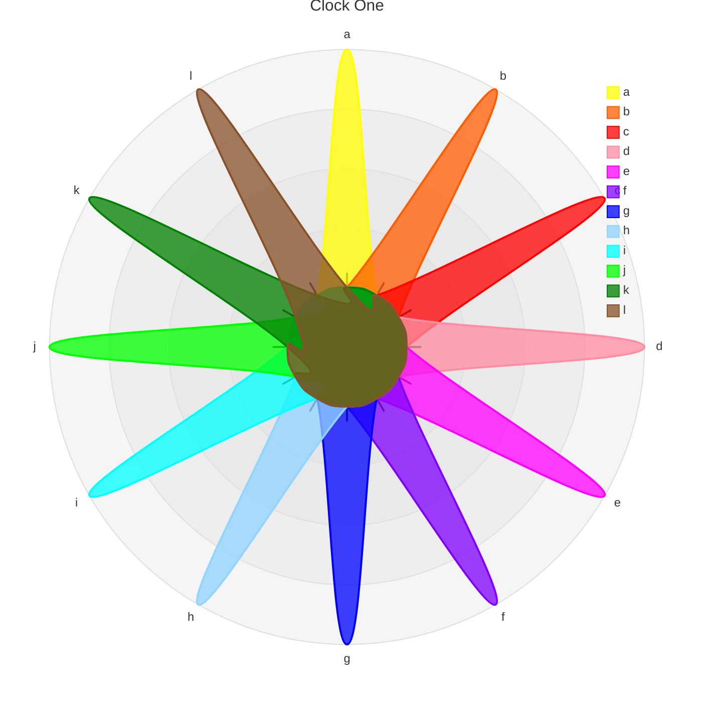
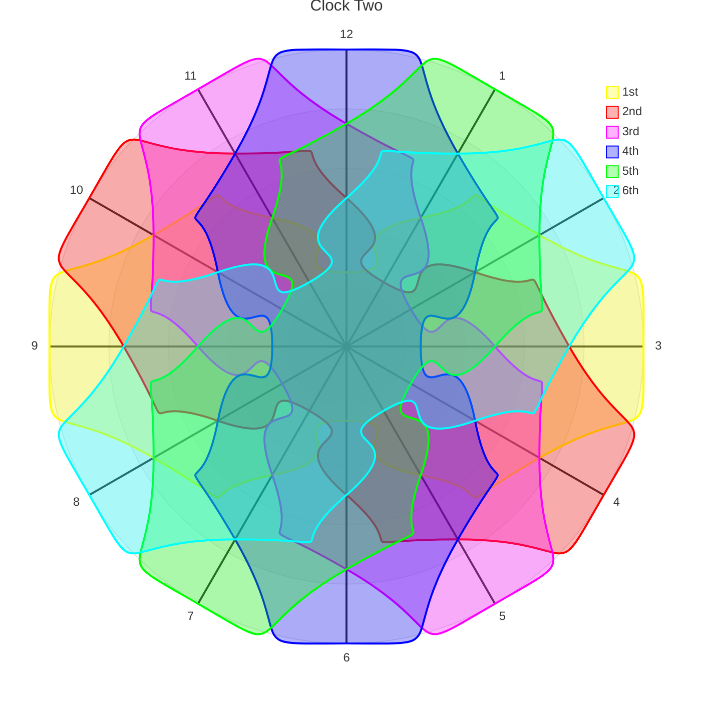
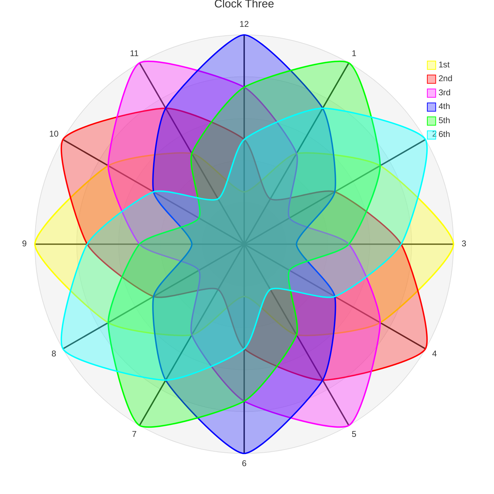

(Radar Diagram Syntax)[https://mermaid.js.org/syntax/radar.html]

```mermaid
---
title: "Clock One"
config:
  radar:
    axisScaleFactor: 0.25
    curveTension: 0.25
  theme: base
  themeVariables:
    cScale0: yellow
    cScale1: "#FF5C00" # orange
    cScale2: red
    cScale3: "#FF8DA1" # pink
    cScale4: magenta
    cScale5: "#7F00FF" # violet
    cScale6: blue
    cScale7: "#90d5ff" # light blue
    cScale8: "#00FFFF" # cyan
    cScale9: lime
    cScale10: green
    cScale11: "#895129" #brown
    radar:
      curveOpacity: 0.75
---
radar-beta
  axis a,b,c,d,e,f,g,h,i,j,k,l
  curve a{5,1,1,1,1,1,1,1,1,1,1,1}
  curve b{1,5,1,1,1,1,1,1,1,1,1,1}
  curve c{1,1,5,1,1,1,1,1,1,1,1,1}
  curve d{1,1,1,5,1,1,1,1,1,1,1,1}
  curve e{1,1,1,1,5,1,1,1,1,1,1,1}
  curve f{1,1,1,1,1,5,1,1,1,1,1,1}
  curve g{1,1,1,1,1,1,5,1,1,1,1,1}
  curve h{1,1,1,1,1,1,1,5,1,1,1,1}
  curve i{1,1,1,1,1,1,1,1,5,1,1,1}
  curve j{1,1,1,1,1,1,1,1,1,5,1,1}
  curve k{1,1,1,1,1,1,1,1,1,1,5,1}
  curve l{1,1,1,1,1,1,1,1,1,1,1,5}
```  

```mermaid
---
title: "Clock Two"
config:
  radar:
    axisScaleFactor: 1.0
    curveTension: 0.5
  themeVariables:
    cScale0: yellow
    cScale1: red
    cScale2: magenta
    cScale3: blue
    cScale4: lime
    cScale5: "#00FFFF" # cyan
    radar:
      curveOpacity: 0.3
---
radar-beta
  axis a["12"],b["1"],c["2"],d["3"],e["4"],f["5"],g["6"],h["7"],i["8"],j["9"],k["10"],l["11"]
  curve a["1st"]{1,2,3,4,3,2,1,2,3,4,3,2}
  curve b["2nd"]{2,1,2,3,4,3,2,1,2,3,4,3}
  curve c["3rd"]{3,2,1,2,3,4,3,2,1,2,3,4}
  curve d["4th"]{4,3,2,1,2,3,4,3,2,1,2,3}
  curve e["5th"]{3,4,3,2,1,2,3,4,3,2,1,2}
  curve f["6th"]{2,3,4,3,2,1,2,3,4,3,2,1}
```

```mermaid
---
title: "Clock Three"
config:
  radar:
    axisScaleFactor: 1.0
    curveTension: 0.1
  themeVariables:
    cScale0: yellow
    cScale1: red
    cScale2: magenta
    cScale3: blue
    cScale4: lime
    cScale5: "#00FFFF" # cyan
    radar:
      curveOpacity: 0.3
---
radar-beta
  axis a["12"],b["1"],c["2"],d["3"],e["4"],f["5"],g["6"],h["7"],i["8"],j["9"],k["10"],l["11"]
  curve a["1st"]{1,2,3,4,3,2,1,2,3,4,3,2}
  curve b["2nd"]{2,1,2,3,4,3,2,1,2,3,4,3}
  curve c["3rd"]{3,2,1,2,3,4,3,2,1,2,3,4}
  curve d["4th"]{4,3,2,1,2,3,4,3,2,1,2,3}
  curve e["5th"]{3,4,3,2,1,2,3,4,3,2,1,2}
  curve f["6th"]{2,3,4,3,2,1,2,3,4,3,2,1}
```
