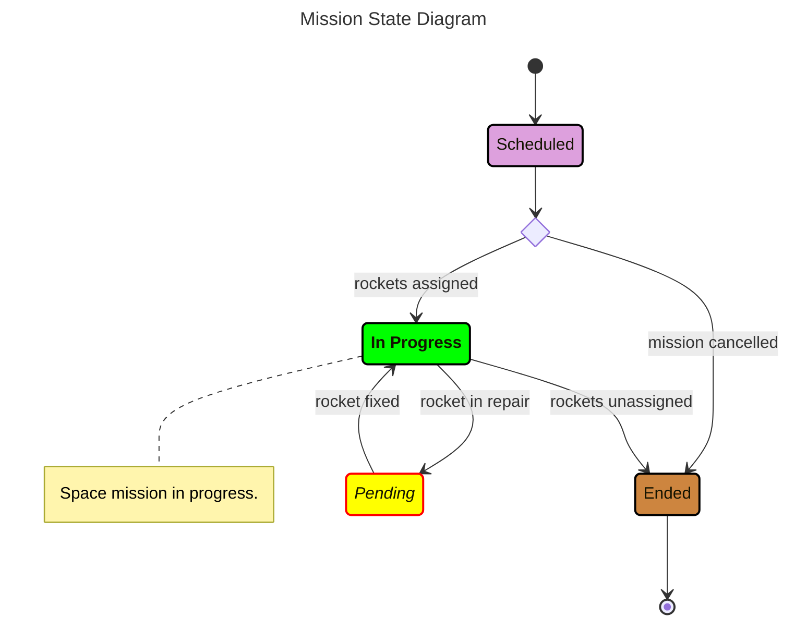

(State Diagram Syntax)[https://mermaid.js.org/syntax/stateDiagram.html]

```mermaid
---
title: Mission State Diagram
---
stateDiagram
direction TB

%% State definitions
state "Scheduled" as SCH
state CHO <<choice>>
state "In Progress" as PRG
note right of PRG
  Space mission in progress.
end note
state "Pending" as PND
state "Ended" as END

%% Transitions
[*] --> SCH:::schedClass
SCH --> CHO
CHO --> PRG:::progClass : rockets assigned
CHO --> END:::endClass : mission cancelled
PRG --> PND:::pendClass : rocket in repair
PND --> PRG : rocket fixed
PRG --> END : rockets unassigned
END --> [*]

%% Style definitions
classDef schedClass fill: plum, stroke: #000, stroke-width: 2px
classDef progClass fill: lime, stroke: #000, stroke-width: 2px,font-weight:bold
classDef pendClass fill: yellow, stroke: #000, stroke-width: 2px, font-style:italic,stroke-width:2px,stroke:red
classDef endClass fill: peru, stroke: #000, stroke-width: 2px
```